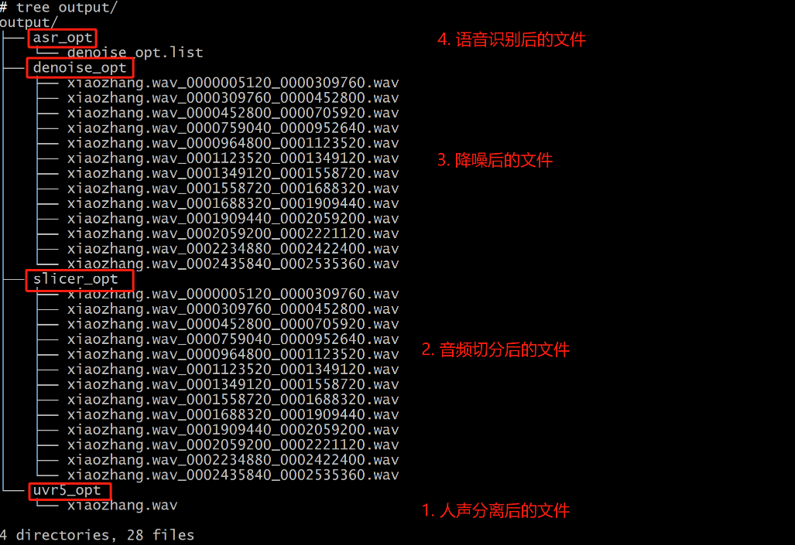
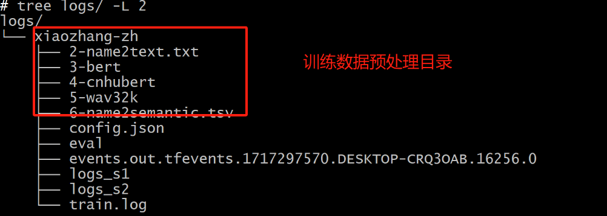
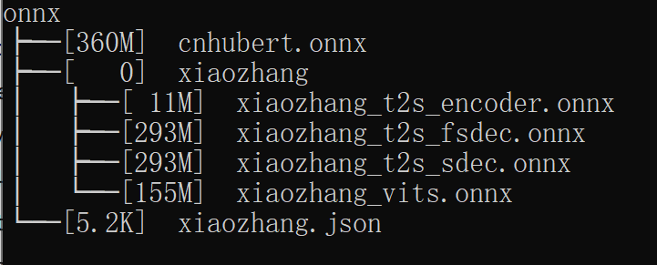

# gpt_sovits原理训练和推理

## 一. 概述
1. 特征：
    - 极速声音克隆：1分钟数据、5-10分钟训练。
    - 跨语种声音克隆：中日英
    - 变声：未实现

## 二. 训练和推理一次
1. 教程：https://www.bilibili.com/video/BV12g4y1m7Uw
2. 4个界面
   - 主界面(训练界面)：runtime\python.exe webui.py :  http://0.0.0.0:9874
   - 声音分离界面：runtime\python.exe" tools/uvr5/webui.py ：http://0.0.0.0:9873
   - 语言识别结果校对界面：runtime\python.exe tools/uvr5/webui.py:  http://0.0.0.0:9873
   - 推理界面：runtime\python.exe" GPT_SoVITS/inference_webui.py：http://0.0.0.0:9872
3. 使用流程
   1. 训练数据清理：
   2. 训练数据预处理：
   3. 训练和推理
4 .模型权重文件
   - 

##  三. 导出onnx
.\runtime\python.exe .\GPT_SoVITS\onnx_export.py

输入输出尺寸：
输入：
gpt_sovits(ref_seq, text_seq, ref_bert, text_bert, ref_audio_sr, ssl_content).detach().cpu().numpy()

## 四. 预处理